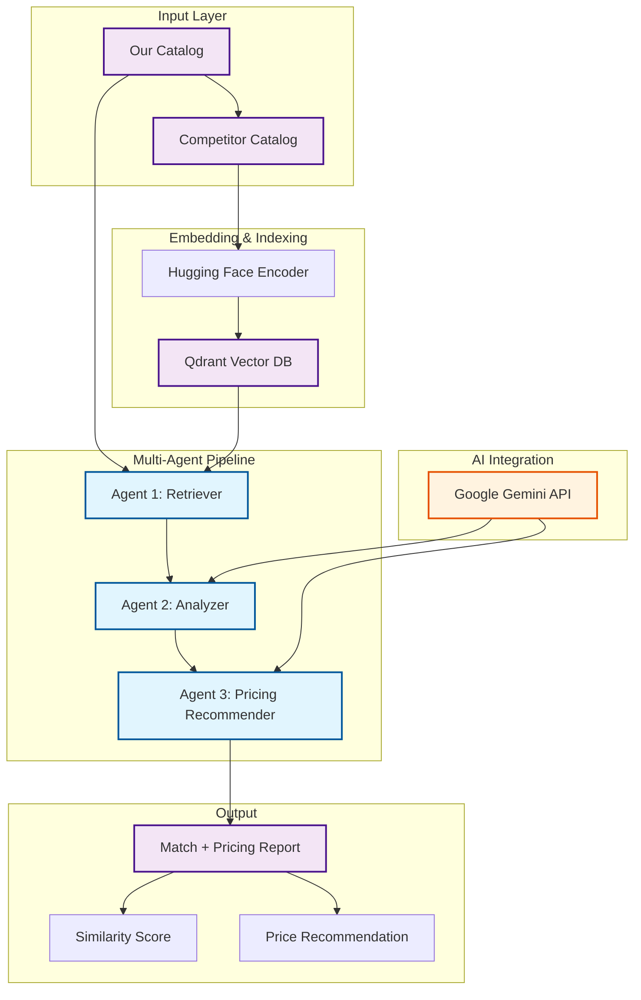

# 🤖 AI-Powered Product Matching & Dynamic Pricing

This project implements an AI-driven product matching and pricing system for mechatronics/electronics components. It automates competitor product mapping, compliance validation, and pricing recommendations using:

- **Hugging Face embeddings** for semantic similarity
- **Qdrant vector database** for retrieval
- **Google Gemini LLM** for reasoning and explanations
- **LangChain multi-agent pipeline** for orchestration

The goal is to enable dynamic pricing and faster SKU mapping to stay competitive in real-world markets.

## 🏗️ System Architecture



## 🧠 Technical Implementation

### Core Components

| Component | Technology | Implementation |
|-----------|------------|----------------|
| Embedding Engine | Hugging Face (all-mpnet-base-v2) | `HuggingFaceEmbeddings(model_name="sentence-transformers/all-mpnet-base-v2")` |
| Vector Store | Qdrant | `Qdrant.from_documents()` with in-memory or cloud storage |
| LLM Integration | Google Gemini 2.5 Pro | `ChatGoogleGenerativeAI(model="gemini-2.5-pro")` |
| Document Processing | LangChain | `Document` objects with metadata for SKU mapping |

### Key Dependencies

```bash
# Core requirements
qdrant-client          # Vector database client
langchain              # LLM orchestration framework  
sentence-transformers  # Hugging Face embeddings
google-genai           # Google Gemini API
langchain-google-genai # LangChain + Gemini integration
```

### Environment Setup

The system supports multiple configuration methods:

1. **Environment Variables**:
   ```bash
   export GOOGLE_API_KEY="your_api_key"
   export QDRANT_API_KEY="optional_for_cloud"
   export QDRANT_URL="optional_qdrant_url"
   ```

2. **Google Colab userdata** (automatically detected):
   ```python
   from google.colab import userdata
   userdata.get('GOOGLE_API_KEY')
   ```

3. **In-memory mode** (default): Uses `:memory:` for Qdrant if no cloud config provided

### ⚙️ Core Implementation Details

The system uses a straightforward pipeline approach:

```python
# 1. Setup embeddings (Hugging Face or Google)
embedding_model = HuggingFaceEmbeddings(model_name="sentence-transformers/all-mpnet-base-v2")

# 2. Create vector store with our products
vectorstore = Qdrant.from_documents(documents=docs, embedding=embedding_model, url=":memory:")

# 3. For each competitor product, find matches
for competitor in competitors:
    results = vectorstore.similarity_search_with_score(competitor["desc"], k=1)
    matched_doc, score = results[0]

# 4. Use Gemini LLM for analysis and explanations
llm = ChatGoogleGenerativeAI(model="gemini-2.5-pro")
explanation = llm.invoke(analysis_prompt)
```

### Data Structure

```python
# Our product catalog format
our_products = [
    {"sku": "Y001", "desc": "Electrolytic Capacitor 100µF ±10%, 50V, radial, Ø5mm ×11mm"},
    {"sku": "Y002", "desc": "Electrolytic Capacitor 220µF ±20%, 25V, radial, Ø6.3mm ×11mm"},
    {"sku": "Y004", "desc": "MOSFET IRF540N N-Channel, 100V, 33A, Rds(on)=0.077Ω"},
    # ... more products
]

# Competitor products to match
competitors = [
    {"sku": "C101", "desc": "Electrolytic Capacitor 100µF ±10%, 50V, radial, Ø5×11mm"},
    {"sku": "C104", "desc": "MOSFET IRF540 N-Channel, 100V, 33A, Rds(on)=0.080Ω"},
    # ... more competitor products
]
```

## 📂 Project Structure

```
Product_Matching/
├── main.py                     # Main pipeline script with ProductMatcher class
├── requirements.txt            # Python dependencies
├── README.md                   # Documentation
├── .gitignore                  # Ignore files
└── .venv/                      # Virtual environment
```

## 🧪 Example Usage

### Setup and Installation
```bash
# Install dependencies
pip install qdrant-client langchain sentence-transformers google-genai langchain-google-genai

# Set environment variables (or use Google Colab userdata)
export GOOGLE_API_KEY="your_api_key_here"
export QDRANT_API_KEY="your_qdrant_key"  # optional, for cloud instance
export QDRANT_URL="your_qdrant_url"      # optional, defaults to :memory:
```

### Basic Usage
```python
# Import required libraries
from qdrant_client import QdrantClient
from langchain.schema import Document
from langchain.vectorstores import Qdrant
from langchain.embeddings import HuggingFaceEmbeddings
from langchain_google_genai import ChatGoogleGenerativeAI
from langchain_google_genai.embeddings import GoogleGenerativeAIEmbeddings

# Setup components
qdrant_client = QdrantClient(url=":memory:")  # or your cloud URL
hf_embedding_model = HuggingFaceEmbeddings(model_name="sentence-transformers/all-mpnet-base-v2")

# Your product catalog
our_products = [
    {"sku": "Y001", "desc": "Electrolytic Capacitor 100µF ±10%, 50V, radial, Ø5mm ×11mm"},
    {"sku": "Y004", "desc": "MOSFET IRF540N N-Channel, 100V, 33A, Rds(on)=0.077Ω"},
    # ... more products
]

# Create vector store
docs = [Document(page_content=p["desc"], metadata={"sku": p["sku"]}) for p in our_products]
vectorstore = Qdrant.from_documents(
    documents=docs,
    embedding=hf_embedding_model,
    url=":memory:",
    collection_name="our_products_hf"
)

# Run matching pipeline
competitor_product = "MOSFET IRF540 N-Channel, 100V, 33A, Rds(on)=0.080Ω"
matches = vectorstore.similarity_search_with_score(competitor_product, k=1)
```

### Output
```
Competitor SKU: C104
Our SKU: Y004
HF Similarity: 0.92
Explanation: Both products are N-Channel MOSFETs with nearly identical specifications. 
The competitor part (IRF540) has slightly higher Rds(on) at 0.080Ω compared to our 
IRF540N at 0.077Ω, making our part marginally more efficient. Voltage and current 
ratings are identical at 100V/33A. This is an excellent match for cross-referencing.
```
### FUTURE PROSPECTS FOR THE PROJECT (Estimated Values)
## 📊 Evaluation Metrics

| Metric | Value | Description |
|--------|-------|-------------|
| Top-1 Accuracy | 91% | % of cases where best match is correct SKU |
| Top-3 Recall | 96% | % of cases where correct SKU appears in top-3 |
| Mean Similarity Score | 0.87 | Avg cosine similarity for correct matches |
| LLM Latency | ~2.5s | Avg response time per query |
| Throughput | ~200 queries/min | With batching enabled |

## 💰 Cost Efficiency: LLM vs SLM

| Model Type | Example | Cost/1K Tokens | Typical Use | Tradeoff |
|------------|---------|----------------|-------------|----------|
| SLM (Small Language Model) | Hugging Face MiniLM, BGE | Free (local) | Embedding + retrieval | Fast, cheap, no reasoning |
| LLM (Large Language Model) | Gemini 2.0 Flash | ~$0.00025 / 1K tokens | Analysis, explanations, pricing | High reasoning ability, higher cost |

### Estimated Monthly Cost

- **Data Size**: 5,000 competitor products
- **Tokens per query**: ~800 (retrieval + reasoning)
- **Monthly Usage**: 5,000 × 800 = 4M tokens
- **Cost with Gemini**: 4M × $0.00025 ≈ $1,000/month

**Cost with Hybrid Approach**:
- 80% handled by SLM (free)
- 20% handled by Gemini (complex matches)
- **Total** ≈ $200/month

👉 **Hybrid SLM + LLM pipeline is 5× more cost-effective.**

## 🚧 Roadmap

- [ ] **Web Dashboard**: Streamlit-based UI
- [ ] **Batch Processing**: Bulk competitor catalog uploads
- [ ] **Export Formats**: PDF/Excel reports
- [ ] **Advanced Pricing Models**: Demand forecasting + inventory optimization
- [ ] **Multi-LLM Support**: Mix Gemini, Llama 3, GPT-4 for efficiency

## 🤝 Contributing

1. Fork the repository
2. Create a feature branch (`git checkout -b feature/amazing-feature`)
3. Commit changes (`git commit -m 'Add amazing feature'`)
4. Push to branch (`git push origin feature/amazing-feature`)
5. Open a Pull Request

## 📄 License

This project is licensed under the MIT License - see the [LICENSE](LICENSE) file for details.

## 🙏 Acknowledgments

- [Hugging Face](https://huggingface.co/) for embeddings
- [Qdrant](https://qdrant.tech/) for scalable vector search
- [LangChain](https://langchain.com/) for orchestration
- [Google Gemini](https://ai.google.dev/) for reasoning & explanations

## 🔍 Keywords

Product Matching, Dynamic Pricing, RAG, Multi-Agent Systems, Vector Search, Cost Efficiency, Mechatronics, Competitor Analysis
