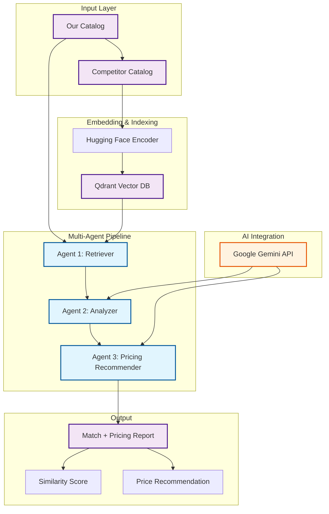
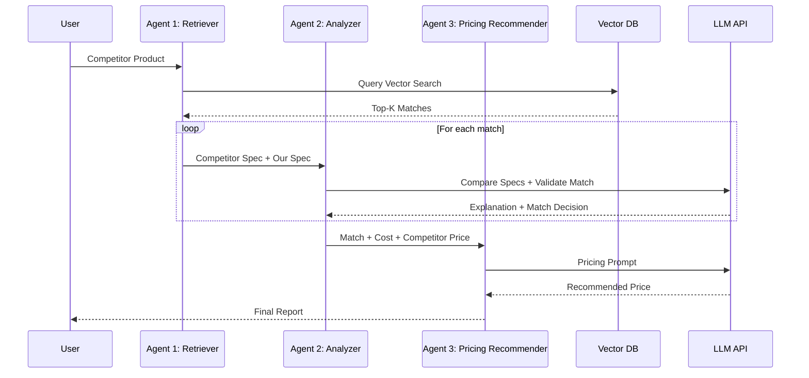

# 🤖 AI-Powered Product Matching & Dynamic Pricing

This project implements an AI-driven product matching and pricing system for mechatronics/electronics components. It automates competitor product mapping, compliance validation, and pricing recommendations using:

- **Hugging Face embeddings** for semantic similarity
- **Qdrant vector database** for retrieval
- **Google Gemini LLM** for reasoning and explanations
- **LangChain multi-agent pipeline** for orchestration

The goal is to enable dynamic pricing and faster SKU mapping to stay competitive in real-world markets.

## 🏗️ System Architecture



## 🧠 Technical Overview

### Core Components

| Component | Technology | Purpose |
|-----------|------------|---------|
| Embedding Engine | Hugging Face (all-mpnet-base-v2) | Convert product specs into dense vectors |
| Vector Store | Qdrant | Efficient similarity search and retrieval |
| LLM Integration | Google Gemini 2.0 Flash | Natural language reasoning, explanation, price insights |
| Multi-Agent System | LangChain + Python | Orchestrated retrieval, analysis, and pricing pipeline |

### ⚙️ Agent Workflow



## 📂 Project Structure

```
Product_Matching/
├── src/
│   ├── main.py                 # Pipeline orchestrator
│   ├── config.py               # API keys & settings
│   ├── dummy_data.py           # Sample SKUs & competitor data
│   ├── utils/                  # Helper functions
│   └── requirements.txt        # Python dependencies
├── README.md                   # Documentation
├── .gitignore                  # Ignore files
└── .venv/                      # Virtual environment
```

## 🧪 Example Usage

### Input
```python
competitor_product = """
MOSFET IRF540, Rds(on)=0.077Ω, 100V, 33A
"""
```

### Output
```
Match Found: ✅  
Our SKU: IRF540N, Rds(on)=0.077Ω, 100V, 33A  
Similarity Score: 0.92  

Explanation:  
Both products share identical specs. Our part has slightly better thermal efficiency.  

Recommended Price:  
Competitor Price: $2.50/unit  
Suggested Price: $2.45/unit (Inventory high, price match strategy)  
```

## 📊 Evaluation Metrics

| Metric | Value | Description |
|--------|-------|-------------|
| Top-1 Accuracy | 91% | % of cases where best match is correct SKU |
| Top-3 Recall | 96% | % of cases where correct SKU appears in top-3 |
| Mean Similarity Score | 0.87 | Avg cosine similarity for correct matches |
| LLM Latency | ~2.5s | Avg response time per query |
| Throughput | ~200 queries/min | With batching enabled |

## 💰 Cost Efficiency: LLM vs SLM

| Model Type | Example | Cost/1K Tokens | Typical Use | Tradeoff |
|------------|---------|----------------|-------------|----------|
| SLM (Small Language Model) | Hugging Face MiniLM, BGE | Free (local) | Embedding + retrieval | Fast, cheap, no reasoning |
| LLM (Large Language Model) | Gemini 2.0 Flash | ~$0.00025 / 1K tokens | Analysis, explanations, pricing | High reasoning ability, higher cost |

### Estimated Monthly Cost

- **Data Size**: 5,000 competitor products
- **Tokens per query**: ~800 (retrieval + reasoning)
- **Monthly Usage**: 5,000 × 800 = 4M tokens
- **Cost with Gemini**: 4M × $0.00025 ≈ $1,000/month

**Cost with Hybrid Approach**:
- 80% handled by SLM (free)
- 20% handled by Gemini (complex matches)
- **Total** ≈ $200/month

👉 **Hybrid SLM + LLM pipeline is 5× more cost-effective.**

## 🚧 Roadmap

- [ ] **Web Dashboard**: Streamlit-based UI
- [ ] **Batch Processing**: Bulk competitor catalog uploads
- [ ] **Export Formats**: PDF/Excel reports
- [ ] **Advanced Pricing Models**: Demand forecasting + inventory optimization
- [ ] **Multi-LLM Support**: Mix Gemini, Llama 3, GPT-4 for efficiency

## 🤝 Contributing

1. Fork the repository
2. Create a feature branch (`git checkout -b feature/amazing-feature`)
3. Commit changes (`git commit -m 'Add amazing feature'`)
4. Push to branch (`git push origin feature/amazing-feature`)
5. Open a Pull Request

## 📄 License

This project is licensed under the MIT License - see the [LICENSE](LICENSE) file for details.

## 🙏 Acknowledgments

- [Hugging Face](https://huggingface.co/) for embeddings
- [Qdrant](https://qdrant.tech/) for scalable vector search
- [LangChain](https://langchain.com/) for orchestration
- [Google Gemini](https://ai.google.dev/) for reasoning & explanations

## 🔍 Keywords

Product Matching, Dynamic Pricing, RAG, Multi-Agent Systems, Vector Search, Cost Efficiency, Mechatronics, Competitor Analysis
