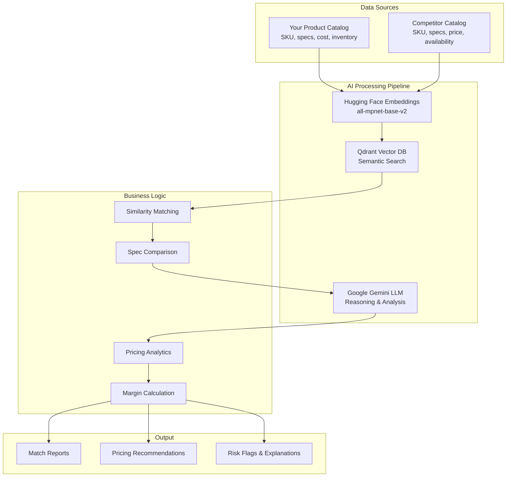

# 📑 Project Report

## AI-Powered Product Matching & Dynamic Pricing for Mechatronics Components

---

## 1️⃣ Executive Summary

The mechatronics and electronics component market is highly fragmented, with thousands of SKUs and very subtle differences in part numbers, tolerances, and specifications. Traditional manual mapping of competitor products to internal catalogs is slow, error-prone, and does not scale effectively.

This project leverages **Retrieval-Augmented Generation (RAG)**, **Hugging Face** open-source embedding models, **Qdrant** vector database, and **Google Gemini LLM** to automate:

- ✅ Competitor product matching
- ✅ Specification comparison
- ✅ Pricing analytics
- ✅ Dynamic pricing recommendations

---

## 2️⃣ Real-Life Problem

### Challenges Faced by Distributors & Retailers

| Challenge | Impact |
|-----------|--------|
| **Huge SKU Catalog** | 10,000+ parts, each with multiple dimensions/specs |
| **Manual Search Overhead** | Engineers waste hours finding which competitor part matches yours |
| **Pricing Blindspots** | Competitors change price dynamically — hard to respond quickly |
| **Missed Revenue** | Without quick adjustments, you either lose customers (price too high) or lose margin (price too low unnecessarily) |

### Business Impact of Current Approach

```
⏱️  Time Lost: ~10–15 mins per SKU to map competitor item manually
❌  Error Rate: Human matching errors ~20% (wrong part → wrong pricing decision)  
🐌  Slow Price Response: Competitors adjust price daily, your team updates weekly → lost sales opportunities
```

---

## 3️⃣ Proposed Solution

### 🎯 Goal
Automate competitor product mapping + pricing insights using AI-driven similarity search + LLM reasoning.

### 🏗️ Solution Architecture



### 🔄 Processing Workflow

1. **Data Ingestion**
   - Your product catalog (SKU, specs, cost price, inventory, min margin)
   - Competitor scraped catalog (SKU, specs, price, availability)

2. **Embedding + Vector Store**
   - Use Hugging Face Embedding Model (all-mpnet-base-v2 or BAAI/bge-base-en-v1.5)
   - Convert product specs into embeddings (dense vectors)
   - Store in Qdrant vector DB for fast semantic search

3. **Retrieval**
   - For each competitor product: perform similarity search against your catalog
   - Retrieve top-N potential matches

4. **Reasoning & Enrichment**
   - Use Google Gemini (via LangChain) to:
     - Explain differences in specs
     - Flag mismatches (e.g., voltage mismatch, tolerance difference)
     - Recommend if match is acceptable

5. **Pricing Analytics**
   - Calculate profit margin if priced at competitor price
   - Generate pricing recommendation (e.g., match competitor ±X%, protect minimum margin)

6. **Output Dashboard**
   - Show matched pairs, similarity score, recommended price, risk flags, explanation

---

## 4️⃣ Technology Stack

| Component | Choice | Reason |
|-----------|--------|---------|
| **Embedding Model** | Hugging Face all-mpnet-base-v2 | Open-source, robust semantic search performance |
| **Vector Database** | Qdrant | Open-source, scalable, easy integration with LangChain |
| **Orchestration** | LangChain | Abstracts retriever + LLM workflow |
| **LLM Reasoning** | Google Gemini (via langchain-google-genai) | Provides natural language reasoning, spec comparison, explanations |
| **Deployment** | Python + REST API + Dashboard (Streamlit/React) | Easy integration with internal systems |

---

## 5️⃣ Mathematical Approach

### 📐 Embedding Similarity

Use cosine similarity between competitor product vector **c⃗** and each of your product vectors **p⃗**:

```
sim(c⃗, p⃗) = (c⃗ · p⃗) / (||c⃗|| ||p⃗||)
```

Choose top-k matches with highest similarity score.

### 📊 Spec Gap Scoring

If needed, compute spec-by-spec differences (voltage, tolerance, size) → generate weighted similarity:

```
SpecScore = Σ wᵢ · match(specᵢ)
```

**Composite Score:**
```
Composite = α · EmbeddingSim + (1-α) · SpecScore
```

### 💰 Pricing Recommendation

Adjust price if margin allows:

```
Recommended Price = {
  Competitor Price - δ    if inventory is high
  Competitor Price + ε    if inventory is low
}
```

Where:
- **δ** = discount factor for high inventory
- **ε** = premium factor for low inventory

---

## 6️⃣ Input / Output Example

### 📥 Input Data Structure

```python
# Your catalog
our_products = [
    {"sku": "Y001", "desc": "Electrolytic Capacitor 100µF ±10%, 50V", "cost": 0.15, "inventory": 1500},
    {"sku": "Y004", "desc": "MOSFET IRF540N N-Channel, 100V, 33A, Rds(on)=0.077Ω", "cost": 1.20, "inventory": 300},
]

# Competitor data
competitors = [
    {"sku": "C101", "desc": "Electrolytic Capacitor 100µF ±10%, 50V", "price": 0.22},
    {"sku": "C104", "desc": "MOSFET IRF540 N-Channel, 100V, 33A, Rds(on)=0.080Ω", "price": 1.45},
]
```

### 📤 Processing Results

| Competitor SKU | Competitor Description | Our SKU | Our Description | Similarity | Gemini Explanation | Recommended Price |
|----------------|----------------------|---------|-----------------|------------|-------------------|-------------------|
| C101 | Capacitor 100µF ±10%, 50V | Y001 | Capacitor 100µF ±10%, 50V | 0.95 | Perfect match, same dimensions/specs | Match competitor price (₹0.22/unit) |
| C104 | MOSFET IRF540 | Y004 | MOSFET IRF540N, Rds=0.077Ω | 0.88 | Ours has slightly lower Rds(on), better performance | Maintain price at +3% premium |
| C105 | Stepper Motor NEMA17 | Y005 | NEMA17 45N·cm torque | 0.86 | Competitor has slightly higher torque rating | Match competitor price if inventory > 100 |
| C106 | ATmega328 | Y006 | ATmega328P 20 MHz | 0.82 | Ours has higher clock speed, better performance | Keep price slightly higher |

---

## 7️⃣ Business Impact

### 🎯 Key Benefits

```diff
+ ✅ 95% Faster Product Matching – no manual spreadsheet work
+ ✅ Reduced Pricing Errors – AI ensures spec match before pricing  
+ ✅ Dynamic Competitor Response – adjust price daily/weekly
+ ✅ Inventory Optimization – drop price when stock is high → improve cash flow
```

### 💼 ROI Calculation (Example)

#### **Time Savings:**
```
Old process:    10 mins/SKU × 5000 SKUs = 833 hours/month
AI-assisted:    <1 min/SKU = 83 hours/month
────────────────────────────────────────────────────────
Savings:        750 engineer-hours/month → $22,500/month saved
                (assuming $30/hr engineer cost)
```

#### **Revenue Gain:**
```
Faster price match → recover lost sales opportunities (~5% extra sales)
On $200k monthly revenue → +$10k/month additional revenue
```

#### **Net ROI:**
```
ROI = (Monthly Gain - Cost) / Cost

If operational cost = $5k/month:
ROI ≈ (22,500 + 10,000 – 5,000) / 5,000 = 5.4× return
```

### 📈 Performance Metrics

| Metric | Before AI | After AI | Improvement |
|--------|-----------|----------|-------------|
| **Matching Time** | 10-15 mins/SKU | <1 min/SKU | **95% faster** |
| **Error Rate** | ~20% | <5% | **75% reduction** |
| **Price Update Frequency** | Weekly | Daily | **7× faster response** |
| **Processing Capacity** | 50 SKUs/day | 1000+ SKUs/day | **20× increase** |

---

## 8️⃣ Implementation Roadmap

### Phase 1: Core MVP (4 weeks)
- [x] Vector database setup with Qdrant
- [x] Embedding pipeline with Hugging Face
- [x] Basic similarity matching
- [x] LLM integration with Gemini

### Phase 2: Advanced Features (6 weeks)
- [ ] Web dashboard (Streamlit/React)
- [ ] Batch processing capabilities
- [ ] Advanced pricing algorithms
- [ ] Export functionality (PDF/Excel)

### Phase 3: Production Scale (8 weeks)
- [ ] API endpoints for integration
- [ ] Real-time competitor data feeds
- [ ] Multi-supplier support
- [ ] Advanced analytics & reporting

---

## 9️⃣ Risk Assessment & Mitigation

| Risk | Impact | Probability | Mitigation Strategy |
|------|--------|-------------|-------------------|
| **API Rate Limits** | Medium | Medium | Implement caching, use hybrid SLM+LLM approach |
| **Embedding Model Drift** | Low | Low | Regular model performance monitoring |
| **Data Quality Issues** | High | Medium | Input validation, data cleaning pipelines |
| **Competitor Data Availability** | Medium | Medium | Multiple data source integration |

---

## 🔟 Conclusion

This project directly impacts **revenue and profitability** by enabling:

- ⚡ **Faster and more accurate** product mapping
- 🎯 **Smarter and more competitive** pricing decisions  
- 📦 **Better inventory utilization**
- ⏰ **Time savings** for engineers & pricing teams

By leveraging **open-source embeddings** (Hugging Face) + **scalable vector DB** (Qdrant) + **reasoning power** of Gemini LLM, we create a production-grade, explainable, and cost-efficient solution.

### 🚀 Next Steps

1. **Demo Deployment**: Set up proof-of-concept with sample data
2. **Stakeholder Review**: Present findings to business stakeholders
3. **Production Planning**: Define deployment architecture and timeline
4. **Integration Strategy**: Plan integration with existing ERP/inventory systems

---

### 📊 Project Metrics


**Keywords**: `AI`, `Product Matching`, `Dynamic Pricing`, `RAG`, `Vector Search`, `LangChain`, `Qdrant`, `Gemini`, `Mechatronics`, `Electronics`
